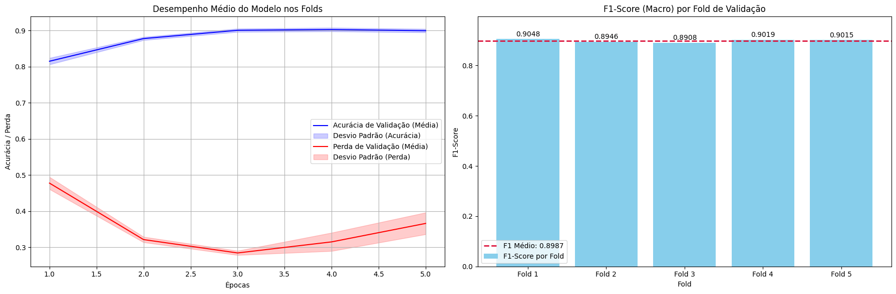
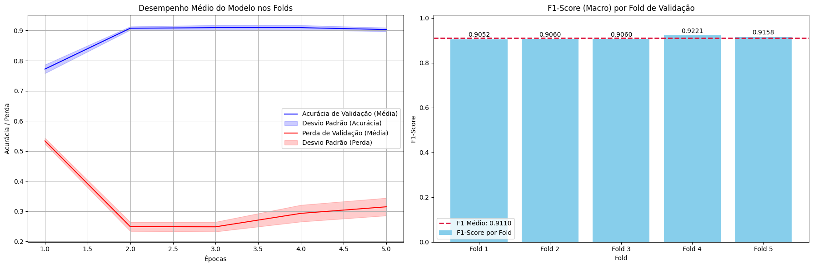

<div align="center">

# Hybrid Hate Speech Detection

### Parallel CNN + Bi-LSTM Architecture

<!-- LANGUAGE SWITCHER -->
[](README_PT.md)

<!-- TECH STACK BADGES -->
<p>
  
  
  
  <a href="https://colab.research.google.com/github/Umbura/Hatespeech_Detection_Civil_Comments_NLP/blob/main/Toxicidade_Civil_Comments_NLP.ipynb">
    
  </a>
</p>

<!-- MAIN IMAGE -->


*Current multiclass classification results on the Civil Comments dataset.*

</div>

---

## About
This Project is a high-performance Deep Learning model developed to not only detect but also classify the type of hate speech being used. Initially focused on the *"insult"* and *"threat"* classes, the scope was expanded to all seven classes of the **Civil Comments** dataset.

The core innovation lies in its **parallel hybrid architecture (CNN + Bi-LSTM)** and the strategic decision **not to use pre-trained embeddings**. This allows the model to learn slang, neologisms, and obfuscated terms specific to toxic vocabulary in any language, without relying on static dictionaries.

---

## Project Evolution

The development followed an iterative methodology based on failure analysis and learning:

### 1. Initial Phase (OvR Prototype)
*   **Approach:** Two-stage *One-vs-Rest (OvR)* classification, inspired by *Pitsilis et al. (2022)*.
*   **Architecture:** Multiple independent Bi-LSTM classifiers.
*   **Result:** Accuracy of ~71% (Below expectations).
*   **Diagnosis:** High complexity in managing multiple models and poor performance in probability integration.

### 2. Intermediate Phase (Sequential Hybrid)
*   **Approach:** Feature extraction with CNN followed by sequential processing (CNN → RNN).
*   **Result:** Accuracy of ~86%.
*   **Crucial Limitation:** The CNN layer filtered the text excessively, causing the subsequent recurrent layer to lose vital contextual information from the original phrase.

### 3. Current Phase v3 (Parallel Hybrid)
*   **Solution:** Simultaneous processing of text in two distinct branches that converge at the end.
*   **Result:** Exceeded the 90% accuracy goal, reaching an **F1-Score of ~0.91** in critical classes (threat and insult).

<div align="center">
  
</div>

---

## Architecture (In Progress)

The model acts as a "committee of experts," processing text input simultaneously in two branches:

1.  **Input & Embedding:** Embedding layer trained from scratch (no weights like GloVe or Word2Vec) to capture dataset-specific nuances.
2.  **Contextual Branch (Bi-LSTM):** Focuses on understanding context and the sequential order of words.
3.  **Pattern Branch (Multi-Kernel CNN):** Focuses on detecting *n-grams* and toxic keywords (local patterns), regardless of their position.
4.  **Fusion & Classification:** The outputs of the two branches are concatenated, offering a rich and diverse view to the final dense layer.

> *Note: In addition to Bi-LSTM, I tested the model with GRU, but there was no significant performance improvement, so I opted to stick with LSTM.*

---

## Data Engineering and Training

To ensure the robustness of the reported results:

*   **Dataset:** [Jigsaw/Civil Comments](https://huggingface.co/datasets/civil_comments).
*   **Balancing:** Used **Undersampling** on majority classes and **Oversampling** on minority ones to ensure a perfectly balanced dataset.
*   **Validation:** Stratified Cross-Validation (*Stratified K-Fold*) with 5 folds.
*   **Optimization:** Used *Early Stopping* to prevent overfitting.

---

## Current Results

| Metric | Average Result | Goal |
| :--- | :--- | :--- |
| **F1-Score** | **0.90** | 0.93 |

> *Note: The 0.90 result is robust, but I noticed an issue with one of the dataset classes; this is likely affecting results that could be higher. However, my project remains active with the goal of refining the architecture to reach at least 0.93, as well as validating the model on PT-BR datasets (which I believe will be facilitated by not using pre-trained embeddings).*

---

## References

This project was grounded in the following works:

1.  **PITSILIS, G. K.** *Improved two-stage hate speech classification for twitter based on Deep Neural Networks*. arXiv preprint arXiv:2206.04162, 2022.
2.  **ZHOU, C. et al.** *A C-LSTM Neural Network for Text Classification*. COLING 2016.
3.  **SCHUSTER, M.; PALIWAL, K. K.** *Bidirectional recurrent neural networks*. IEEE Transactions on Signal Processing, 1997.
4.  **JIGSAW/GOOGLE.** *Jigsaw Unintended Bias in Toxicity Classification*. Kaggle, 2019.

---

## How to Run

### Requirements
*   Python 3.8+
*   TensorFlow 2.x
*   Libraries listed in `requirements.txt`

### Installation
```bash
git clone https://github.com/Umbura/Hatespeech_Detection_Civil_Comments_NLP.git
pip install -r requirements.txt
```
### License
Distributed under the Apache 2.0 license. See the LICENSE file for more details.
